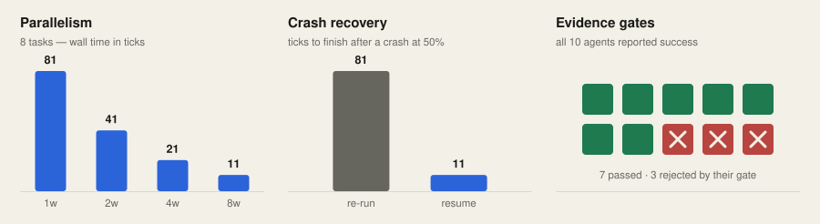

<h1 align="center">&nbsp;Corral</h1>

<p align="center"><strong>Your agents say they're done. Corral makes them prove it.</strong></p>

<div align="center">

[](https://github.com/thiago-ss/corral/actions/workflows/ci.yml)
[](https://github.com/thiago-ss/corral/releases)
[](https://go.dev)
[](LICENSE)
[](https://github.com/thiago-ss/corral/stargazers)

</div>

<div align="center">
  <a href="docs/assets/tui.svg"><picture><source media="(max-width: 900px)" srcset="docs/assets/tui-mobile.svg"></picture></a>
</div>

<p align="center">
  <a href="#quick-start"><strong>Install</strong></a> ·
  <a href="#how-it-works">How it works</a> ·
  <a href="#benchmarks">Benchmarks</a> ·
  <a href="docs/codex.md">Codex guide</a> ·
  <a href="CHANGELOG.md">Changelog</a>
</p>

---

Run a coding agent long enough and you hit the same wall: it announces that it
finished, and you have no idea whether it did. You read the diff yourself. You
re-run the tests yourself. You babysit one terminal at a time, and when the
process dies you start over.

**Corral is the pipeline around your agents, not another agent.** It turns one
goal into a validated task graph, runs the nodes in parallel inside isolated git
worktrees, and refuses to call anything "done" until a command exits `0`, a JSON
Schema validates, or a real diff shows up. Every transition lands in a SQLite
event log, so a crash resumes instead of restarting.

### Highlights

<p align="center">
  <picture><source media="(prefers-color-scheme: dark)" srcset="docs/assets/bench-dark.svg"></picture>
</p>

<p align="center"><sub>Regenerate with <code>go run ./cmd/bench | python3 scripts/make_bench_figure.py</code> · <a href="#benchmarks">full tables below</a></sub></p>

- 🔀 **Actually parallel** — leased workers, each in its own branch and worktree. [7.4× faster](#benchmarks) at 8 workers, 92% scaling efficiency.
- 🔒 **Evidence, not vibes** — a node completes when a command, schema, diff, or reviewer says so. Prose alone fails the gate. In the simulation above, that catches 3 of 10 agents that all claimed success.
- 💾 **Crash-durable** — completed nodes stay done. A run killed halfway resumes in 11 ticks where a naive re-run costs 81.
- 🎛️ **You hold the merge** — approval is an explicit graph node before a `--no-ff` merge. Nothing lands unwatched.
- 📼 **Full provenance** — ordered events, attempts, verdicts, branches, and artifacts for every run, exportable as an audit trail.

> The two claims above with no bar next to them — operator approval and
> provenance — are structural properties, not measurements. They are stated as
> plainly as they can be, and deliberately not charted.

## Table of contents

- [Why Corral](#why-corral)
- [Quick start](#quick-start)
- [How it works](#how-it-works)
- [What counts as evidence](#what-counts-as-evidence)
- [Benchmarks](#benchmarks)
- [The TUI](#the-tui)
- [Operations](#operations)
- [Run-level safeguards](#run-level-safeguards)
- [Architecture](#architecture)
- [Development](#development)
- [Scope and roadmap](#scope-and-roadmap)
- [Alternatives](#alternatives)
- [License](#license)

## Why Corral

A single agent session is good at one interactive task. Corral is built for a
different mode: _deliver this graph of work even if tasks run in parallel, a
gate fails, or the process restarts._

| | Agent session | Corral |
|---|---|---|
| **Work model** | one conversation | validated DAG of `agent`, `check`, `human_gate`, `merge` nodes |
| **Completion** | model says "done" | command, JSON Schema, reported-diff, or reviewer evidence passes |
| **Parallelism** | terminals you coordinate by hand | leased workers in separate branches and worktrees |
| **Failure** | you re-prompt manually | bounded retry, with the failure reason fed into the next attempt |
| **Restart** | reconstruct context from scratch | completed nodes stay done; interrupted attempts restart |
| **Provenance** | a transcript | ordered events, attempts, verdicts, branches, artifacts |

## Quick start

Requirements: Git, OpenCode 1.18+, and macOS or Linux on `amd64` or `arm64`.

```sh
# Install to ~/.local/bin
curl -fsSL https://raw.githubusercontent.com/thiago-ss/corral/main/scripts/install.sh | sh
corral version

# Initialize and start
cd your-repo
corral up
```

`corral up` checks the repository, creates `.corral/`, installs the OpenCode
tool at `.opencode/tools/corral.ts`, merges five Corral agent definitions into
`opencode.json`, starts the daemon, and runs `corral doctor`. Existing agent
entries are preserved. Restart OpenCode after the first setup.

Then, inside OpenCode:

1. Switch to `corral-planner` and ask: `plan a graph to <your goal>`.
2. **Review the returned graph.**
3. Switch to `corral-orchestrator` and ask it to start that graph.
4. Follow progress with `corral_status` / `corral_watch`; approve, reject,
   retry, cancel, or steer nodes as needed.

Prefer the terminal? `corral tui` follows the same run.

Using Codex instead? The full copy/paste flow lives in
[`docs/codex.md`](docs/codex.md). Codex drives Corral as an operator; OpenCode
still runs the isolated worker sessions.

## How it works

<p align="center">
  <a href="docs/brand.md"><picture><source media="(prefers-color-scheme: dark)" srcset="docs/assets/hero-dark.png"></picture></a>
</p>

1. **Plan.** A read-only planner turns the goal into a graph. You review it
   before it starts.
2. **Run.** Ready agent nodes execute concurrently. Every writing attempt gets
   its own branch and worktree.
3. **Verify.** A command, JSON Schema, or default non-empty-diff gate decides
   whether an attempt is complete. Idle model output is not completion.
4. **Retry.** A failed verdict feeds its reason into the next attempt, within
   the node's retry limit.
5. **Approve and land.** A `human_gate` precedes a `--no-ff` merge into the
   branch checked out when the merge begins.

> [!IMPORTANT]
> Human approval is a graph node, not a validator invariant. The supplied
> planner is instructed to generate the approval path above — but **inspect
> every graph before running it.**

## What counts as evidence

Corral wires four completion paths:

| Gate | Passes when |
|---|---|
| **Command** | an argv-style command runs in the attempt worktree and exits `0` |
| **JSON Schema** | a declared JSON artifact validates against the schema |
| **Default diff** | no gate declared → at least one file diff is reported by the driver. Prose alone fails. |
| **Reviewer** | a read-only OpenCode session reviews the objective, prior feedback, transcript, recorded diff, and check results, then returns exactly `APPROVED` or `CHANGES_REQUESTED` plus a required `Note:` line |

A reviewer's change request returns its note as focused retry feedback. Set
`CORRAL_REVIEWER_MODEL` to a `provider/model` value to pick the review model.

## Benchmarks

Reproduce every number below in one command — no cluster, no API keys:

```sh
make bench     # or: go run ./cmd/bench
```

**Parallelism.** Eight independent tasks, deterministic fake clock, wall time in
scheduler ticks:

| Workers | Ticks | Speedup | Scaling efficiency |
|---:|---:|---:|---:|
| 1 | 81 | 1.0× | 100% |
| 2 | 41 | 2.0× | 99% |
| 4 | 21 | 3.9× | 96% |
| 8 | 11 | 7.4× | 92% |

**Crash recovery.** Kill the run at 50% done, then resume:

| Strategy | Ticks to finish |
|---|---:|
| Naive sequential re-run | 81 |
| Corral resume (4 workers) | **11** |

7.4× lower time-to-finish, combining durable state with parallel execution.

**Evidence gates.** Ten scripted agents all report success; three wrote the
wrong content:

| | Result |
|---|---|
| Agents claiming done | 10 |
| Rejected by their gate | **3** |
| Would have merged broken work without gates | 3 / 10 |

> [!NOTE]
> These come from a deterministic fake-clock simulation with scripted agents.
> It measures **scheduler and gate behavior, not model quality.** The 3 / 10
> failure rate is a fixed scenario, not an estimate of how often real models
> are wrong.

## The TUI

```sh
corral tui
```

The TUI follows durable server-sent run events and falls back to polling after a
stream failure. It exposes graph state, live transcript tails, budget usage,
attempts, sessions, worktrees, evidence, permissions, and operator actions, and
can raise desktop attention when a gate needs approval or a node fails.

Worker edits stay in attempt worktrees; initialization itself may add the
OpenCode tool and agent config to your checkout.

## Operations

| Command | Purpose |
|---|---|
| `corral status` | List runs through the daemon |
| `corral tui` | Open the companion dashboard |
| `corral doctor` | Check OpenCode, Git, daemon, plugin, and config |
| `corral update` | Install a newer GitHub release after a sanity check |
| `corral export <runID>` | Print the full audit export |
| `corral worktrees` | List attempt worktrees; `--prune` removes clean merged/removed and stale ones |

`status`, `tui`, `doctor`, and `export` read the repository key automatically.

`corral worktrees` works directly on git — no daemon, no key. It lists worktrees
kept after failed attempts (path, branch, HEAD, last activity, dirty/locked
markers). `--prune` removes only clean ones that are safe to drop: branches
already merged into the main checkout, and — with `--stale <duration>`, e.g.
`24h` — worktrees idle longer than that. It never touches the main checkout;
dirty, locked, and detached worktrees are left alone.

## Run-level safeguards

Enabled by default. Each is overridable by environment variable; `0` disables
it. These are ceilings for runaway runs — normal runs should never hit them.

| Variable | Default | Behavior |
|---|---|---|
| `CORRAL_BREAKER_MAX_FAILURES` | `5` | Circuit breaker: after `N` node failures in the window, the run stops starting new work; pending nodes are blocked (`reason: circuit breaker`). An operator retry resets it. |
| `CORRAL_BREAKER_WINDOW` | `900` (15 min) | Rolling window, in seconds, for counting failures. |
| `CORRAL_RUN_MAX_TOKENS` | `1_000_000` | Run-level token budget across all finished attempts; once exceeded, pending nodes are blocked. |
| `CORRAL_RUN_MAX_COST` | `100` (USD) | Run-level cost budget across all finished attempts; once exceeded, pending nodes are blocked. |

```sh
CORRAL_BREAKER_MAX_FAILURES=3 \
CORRAL_RUN_MAX_TOKENS=250000 \
corral up
```

## Architecture

<p align="center">
  <a href="docs/brand.md"><picture><source media="(prefers-color-scheme: dark)" srcset="docs/assets/ledger-dark.png"></picture></a>
</p>

Every scheduler transition leaves an ordered event. Failed verdicts and their
evidence remain stored when an attempt retries.

- **Isolation** — each writing attempt receives a branch and worktree. Declared
  write scopes that overlap are serialized; scopes are scheduling hints, not a
  filesystem sandbox.
- **Verification** — verdicts are separate from model output. Failed evidence is
  stored; while the daemon is up, its reason becomes focused retry feedback.
- **Durability** — transitions and verdicts append to the SQLite event log with
  a monotonic per-run sequence. On load, the scheduler reconstructs its
  in-memory tracker from events.
- **Recovery** — terminal nodes stay terminal. Attempts interrupted in `leased`,
  `running`, or `verifying` return to `ready` and execute as a new attempt.
- **Landing** — merge nodes commit accepted worktree changes, merge with
  `--no-ff`, run their post-merge command, and prune consumed worktrees.

The core packages are deliberately small:

| Package | Responsibility |
|---|---|
| `internal/graph` | graph schema, validation, states, ready computation |
| `internal/sched` | leases, priority, retries, gates, merge orchestration |
| `internal/store` | SQLite event log, materialized nodes, attempts, artifacts |
| `internal/verify` | command, JSON Schema, diff, and reviewer evidence |
| `internal/worktree` | branch/worktree lifecycle and diff artifacts |
| `internal/ocxadapter` | OpenCode sessions and completion reconciliation |
| `internal/claudeadapter` | standalone Claude Code sessions, usage, permission mediation |
| `internal/ocxreviewer` | OpenCode reviewer sessions for the reviewer gate |
| `internal/daemon` | control API, planning, role routing, audit export |
| `internal/tui` | terminal dashboard and operator controls |

Visual language, color roles, and asset rules live in the
[brand guide](docs/brand.md).

## Development

```sh
make test       # deterministic
make test-live  # real provider
make race       # race detector
make bench      # the numbers above
make vet        # vet + format check
```

## Scope and roadmap

Corral is local, single-machine, single-repository software today. OpenCode is
the production-wired executor. The generic `adapter.Driver` interface is the
seam for additional executors.

**Executor status**

| Executor | Status |
|---|---|
| OpenCode | ✅ production-wired |
| Claude Code | 🟡 adapter implemented (permission mediation, usage, streaming); no daemon selection path yet |
| Codex | 🟡 usable as an operator via the terminal ([guide](docs/codex.md)); not a native executor |
| [Pi](https://github.com/earendil-works/pi) / [Oh My Pi](https://github.com/can1357/oh-my-pi) | ⬜ planned — both expose NDJSON-over-stdio (`--mode rpc`), which maps cleanly onto `adapter.Driver` |

**Also planned:** distributed workers, interactive graph editing, and a web
dashboard.

## Alternatives

Corral deliberately does not compete with the agents themselves — it schedules
them. If you want something different:

- **[OpenCode](https://github.com/sst/opencode) / [Claude Code](https://github.com/anthropics/claude-code) / [Oh My Pi](https://github.com/can1357/oh-my-pi)** — the interactive agents. Corral runs these, it doesn't replace them.
- **[git worktree](https://git-scm.com/docs/git-worktree) + shell scripts** — fine for a couple of parallel branches; no evidence gates, retries, or durable state.
- **CI pipelines** — strong verification, but they gate work that already exists rather than scheduling agents to produce it.

## Star history

<a href="https://star-history.com/#thiago-ss/corral&Date">
  <picture>
    <source media="(prefers-color-scheme: dark)" srcset="https://api.star-history.com/svg?repos=thiago-ss/corral&type=Date&theme=dark" />
    <source media="(prefers-color-scheme: light)" srcset="https://api.star-history.com/svg?repos=thiago-ss/corral&type=Date" />
    
  </picture>
</a>

If Corral saved you a merge you would have regretted, a ⭐ helps other people
find it.

## License

MIT — see [LICENSE](LICENSE).
