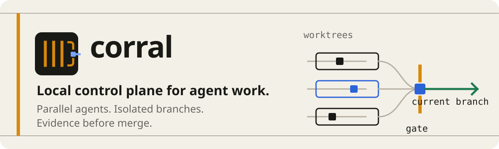
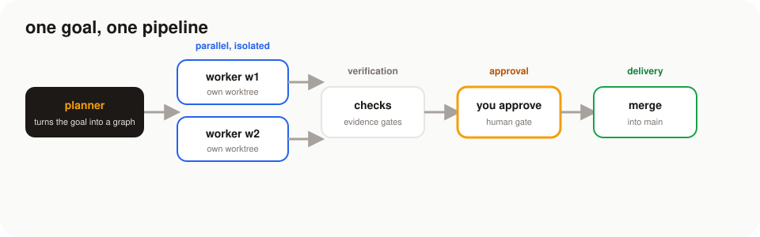
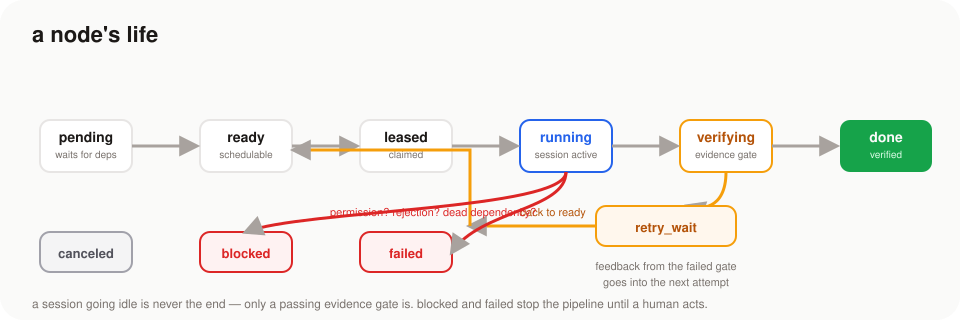
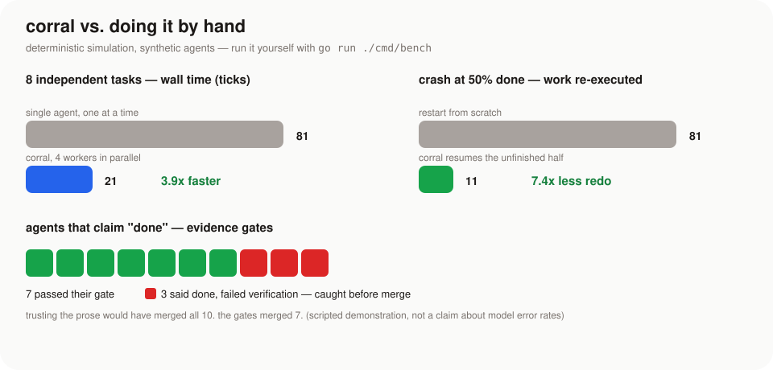
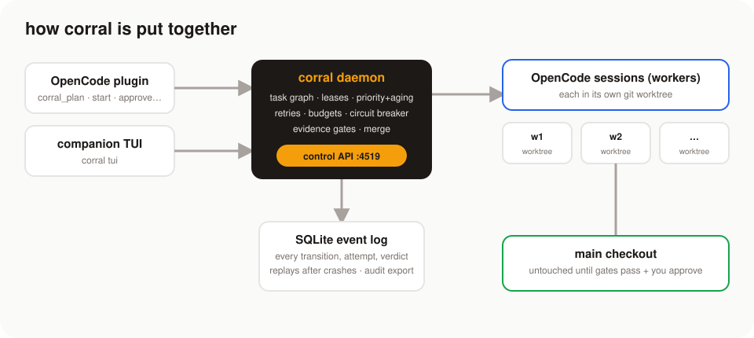

<div align="center">



**durable orchestration for agent runs** — plan a task graph, run parallel agents in isolated worktrees, gate everything with evidence, approve and merge. Crash-safe, auditable, and it survives restarts without redoing work.

[](https://github.com/thiago-ss/corral/actions/workflows/ci.yml)
[](https://github.com/thiago-ss/corral/actions/workflows/release.yml)
[](https://go.dev)
[](LICENSE)

```sh
curl -fsSL https://raw.githubusercontent.com/thiago-ss/corral/main/scripts/install.sh | sh
cd your-repo && corral up
```

</div>

---

## What this is

You know the pattern. You hand a task to an agent, it works for a while, and it says "done". Sometimes it is done. Sometimes it touched the wrong files, or "fixed" something that was already fine, or stopped mid-way and forgot to tell you. If the machine restarts, you start over. If you wanted three things done in parallel, you open three terminals and babysit them.

**corral is the CI for agent work.** It takes a goal, turns it into a graph of small tasks, runs them in parallel — each in its own git worktree — and refuses to call anything done until an *evidence gate* proves it. Nothing touches `main` until you approve. If the daemon crashes, it picks up exactly where it left off, and it can prove it.

It is **not** another agent. The agents are still OpenCode (and later Codex, Claude CLI, whatever). corral is the pipeline around them: plan → parallel work → verification → approval → merge.

## How a run looks



Concretely:

1. **Plan** — a read-only planner agent turns your goal into a task graph. You read it, change it, approve it.
2. **Work** — workers run concurrently, each in its own worktree with its own branch. Your working tree stays clean the whole time.
3. **Verify** — every attempt must pass its gate: a command, a JSON-schema check, a reviewer — or at minimum produce a diff. A session going idle is not a result.
4. **Approve** — a human gate parks the run until you say yes (or no).
5. **Merge** — accepted branches are folded into `main`, post-merge checks run, consumed worktrees are cleaned up.

Fail a gate? The node retries automatically — the *reason it failed* is fed back into the next attempt. Exhaust retries? The node fails, its dependents block, and the run waits for you. No silent half-done states.



## Why this beats "just prompt an agent"

The honest comparison:

| | A single agent session | corral |
|---|---|---|
| Unit of work | one conversation | a **task graph** with typed nodes (agent, check, merge, human gate) |
| "Done" means | the model said so | **an evidence gate passed** — command, schema, reviewer, or real diffs |
| Retries | you re-prompt, hoping | **automatic and bounded**, with the failed gate's feedback injected into the next attempt |
| Parallel work | you juggle terminals | **fan-out / fan-in**, priority + aging, leases, concurrency limits |
| Your working tree | the agent edits it directly | **untouched until you approve** — every writer gets its own worktree |
| Restart | hope you saved the transcript | **exactly-once resume** — completed attempts never re-run |
| Budgets | watch the bill | per-node and per-run **time / token / cost** budgets, circuit breakers |
| Supervision | every keystroke, or none | you approve the **decision points**: the graph, the gates, the merge |
| Audit | a chat log | a full **event log + export**: attempts, sessions, worktrees, content-addressed diffs |

## Numbers from the simulation



Those are deterministic — the scheduler runs on a fake clock with scripted agents, so the same numbers come out every time. **Run them yourself:**

```sh
make bench     # or: go run ./cmd/bench
```

The "3 out of 10 said done but failed verification" panel is a scripted illustration, not a claim about model error rates — but it is exactly the failure mode gates exist for.

## Getting started

Requirements: `opencode` ≥ 1.18 on your PATH, and a git repository.

```sh
# install
curl -fsSL https://raw.githubusercontent.com/thiago-ss/corral/main/scripts/install.sh | sh
corral version

# in your repo — one command does everything:
corral up
```

`corral up` checks git, writes `.corral/` (API key, config, log), installs the OpenCode plugin, adds five agent roles (`corral-planner`, `corral-orchestrator`, `corral-worker`, `corral-reviewer`, `corral-merger`) to `opencode.json` — without touching anything you already configured — starts the daemon, and runs `corral doctor`. Restart OpenCode and you're ready.

Then, inside OpenCode:

1. Switch to **corral-planner** (Tab) and say: *"plan a graph to <your goal>"* — it returns a graph JSON. Read it.
2. Switch to **corral-orchestrator** and say: *"start this run: <the graph>"*.
3. Follow it with `corral_status`, approve the gate with `corral_approve`, and watch the merge fold the work into main.

Or watch it live in the terminal dashboard:

```sh
corral tui      # ↑/↓ navigate · enter run · a approve · i inspect · s steer · t retry · c cancel
```

### Everyday ops

```sh
corral status                # what's running, through the daemon
corral doctor                # opencode, git, daemon, plugin, config — one check each
corral export <runID>        # full audit trail to JSON
corral update                # self-update from GitHub releases (no downgrades, sanity-checked)
```

## How it's built



The important pieces:

- **SQLite event log** is the source of truth — every transition, attempt and verdict is an append-only event with a monotonic sequence. "What's the state?" is answered by replaying the log, which is also what makes crash recovery exact.
- **Leases and a single control loop** — nodes are claimed with expiring leases; one deterministic `Step` does all state changes, so the scheduler is fully testable with a fake clock.
- **The adapter contract** is generic. OpenCode is the first driver; the same `adapter.Driver` interface is the seam for Codex, Claude CLI, or any future backend.
- **Verification is a library** (`internal/verify`) — command gates, JSON-schema gates, reviewer gates, and the default rule: no diff, no done.
- **Worktree isolation** (`internal/worktree`) — branch-per-attempt, content-addressed diff artifacts, scope-collision blocking so writers with overlapping scope never run concurrently.
- **Roles are enforced twice** — OpenCode's per-agent permissions, and the daemon's own role checks. A worker agent physically cannot start or approve a run.

## Questions people ask

**Is this another agent?** No. corral has no model of its own. The workers are OpenCode sessions. corral decides *who runs, when, in what order, with what proof, and whether it may land*.

**Why not just use Claude Code / Codex / OpenCode directly?** For an interactive session — do. They're great at that. corral is for the other mode: *"take this goal and deliver a verified, merged result, even if I'm not watching and even if the machine restarts."*

**Do I have to write the graph by hand?** No — the planner agent writes it from your goal, and you review it before it starts. You'll edit it once you get picky (that's the point of reviewing).

**What counts as "verified"?** Whatever you say it is: a command that exits 0 (a grep, a test run), a JSON-schema check on a produced artifact, a reviewer agent's approval — or, with no gate declared, at least one real file diff. Prose alone never passes.

**What happens if the daemon crashes mid-run?** It resumes on restart. Completed attempts are never re-executed (tested); interrupted ones are re-run exactly once. The event log replays to the exact same state. `corral up` again and it's back.

**Is my main branch safe?** Workers write only in their own worktrees. Nothing merges until every dependency is done, checks pass, and you approve the gate. Rejection blocks the merge and the run waits.

**Can it run Codex or Claude instead of OpenCode?** The adapter contract is generic; OpenCode is the implemented driver. That's the planned seam.

**What's deliberately NOT included?** Distributed workers, autonomous deployment, graph cycles, self-mutating graphs, knowledge graphs. Single machine, one repository, humans in the loop at the important moments.

## Development

```sh
make test       # deterministic suite — no model, no network, ~15s
make test-live  # full suite including real-OpenCode integration (needs a provider)
make race       # deterministic suite under the race detector
make bench      # the benchmark numbers above
make vet        # go vet + gofmt
```

The repo is mostly `internal/`: `sched` (the loop), `store` (SQLite), `graph` (schema + state machine), `verify` (gates), `worktree` (isolation), `ocxadapter` (OpenCode driver), `daemon` (API), `tui` (dashboard). The deterministic tests are the interesting ones — the scheduler is a state machine you can read like a spec.

## Roadmap

- [ ] More drivers (Codex CLI, Claude CLI) behind the adapter contract
- [ ] Interactive graph editing in the TUI
- [ ] Run-level dashboards / web panel
- [ ] Multi-machine workers

## License

MIT — see [LICENSE](LICENSE).
