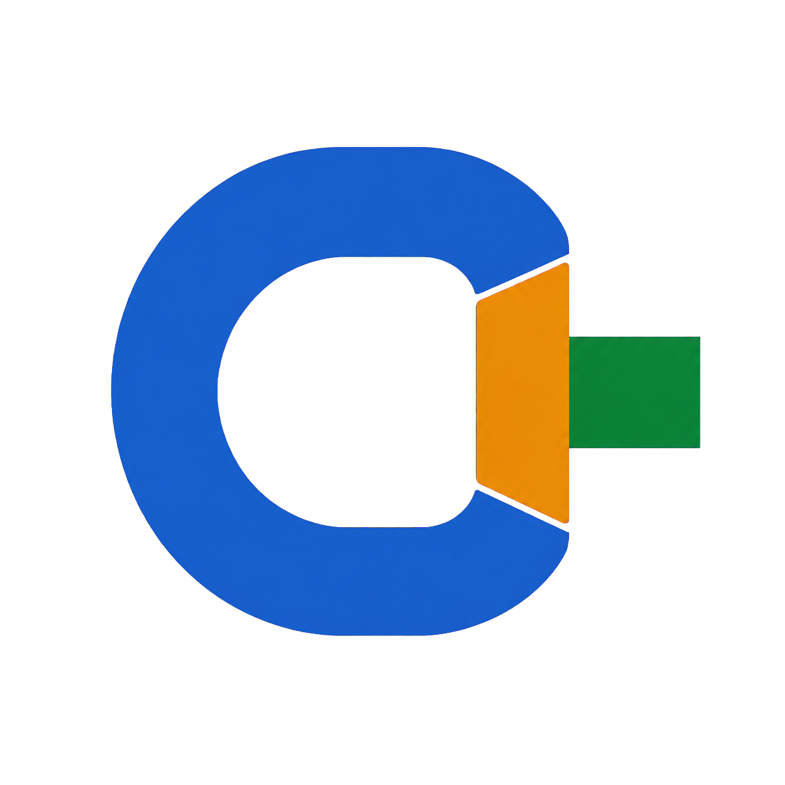
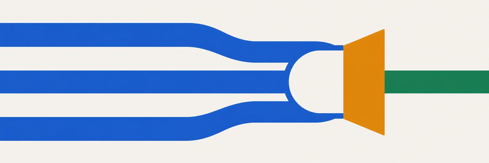
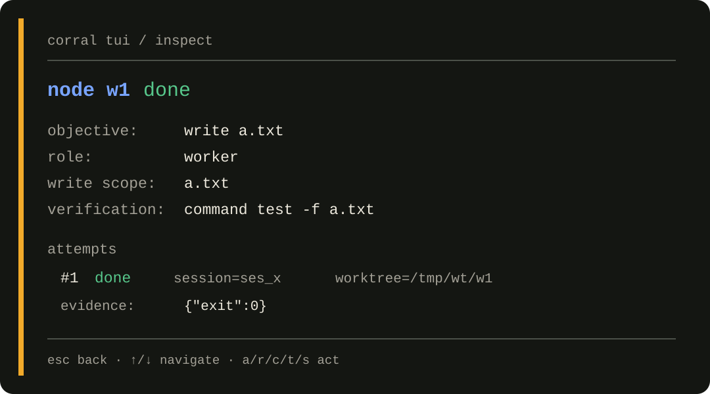
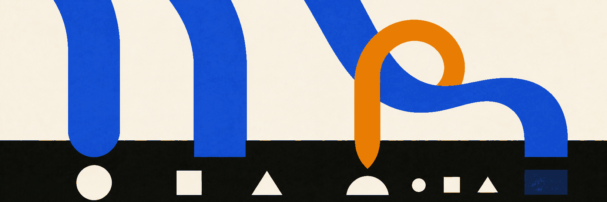

<h1 align="center">&nbsp;Corral</h1>

<p align="center"><strong>Parallel agents. Isolated branches. Evidence before merge.</strong></p>

<div align="center">

[](https://github.com/thiago-ss/corral/actions/workflows/ci.yml) [](https://github.com/thiago-ss/corral/releases) [](https://go.dev) [](LICENSE)

[Why Corral](#why-corral) · [Default run](#the-default-run) · [Install](#quick-start) · [Architecture](#how-trust-is-built)

**[Install and run →](#quick-start)**

</div>

<p align="center">
  <a href="docs/brand.md"><picture><source media="(prefers-color-scheme: dark)" srcset="docs/assets/hero-dark.png"></picture></a>
</p>

Corral is a local control plane for agent work. It turns a goal into a validated
task graph, schedules OpenCode workers in isolated git worktrees, checks their
output with machine-readable evidence, records the run in SQLite, and gives the
operator explicit controls before work lands.

Corral is not another coding agent. It is the durable pipeline around agents.

## Why Corral

An agent session is good at one interactive task. Corral is for a different
mode: _deliver this graph of work even if tasks run in parallel, a gate fails,
or the process restarts._

- **Work model:** one conversation → a validated DAG of `agent`, `check`,
  `human_gate`, and `merge` nodes.
- **Completion:** model says “done” → command, JSON Schema, or reported-diff
  evidence passes.
- **Parallelism:** terminals you coordinate → leased workers in separate
  branches and worktrees.
- **Failure:** manually re-prompt → bounded retry after a failed gate.
- **Restart:** reconstruct context → completed nodes stay done; interrupted
  attempts restart.
- **Provenance:** transcript → ordered events, attempts, verdicts, branches,
  and artifacts.

## The default run

1. **Plan.** A read-only planner turns the goal into a graph. You review the
   graph before starting it.
2. **Run.** Ready agent nodes execute concurrently. Every writing attempt gets
   its own branch and worktree.
3. **Verify.** A command, JSON Schema, or default non-empty-diff gate decides
   whether an attempt is complete. Idle model output is not completion.
4. **Retry.** Within a live daemon, a failed verdict feeds its reason into the
   next attempt, within the node's retry limit.
5. **Approve and land.** The supplied planner is instructed to place a
   `human_gate` before a no-fast-forward merge into the branch that is checked
   out when the merge begins.

> **Important:** Human approval is a graph node, not a validator invariant. The
> supplied planner is instructed to generate the approval path shown above;
> inspect every graph before running it.

## Quick start

Requirements: Git, OpenCode 1.18+, and macOS or Linux on `amd64` or `arm64`.

```sh
# Install to ~/.local/bin.
root=https://raw.githubusercontent.com
repo=thiago-ss/corral
script=main/scripts/install.sh
curl -fsSL "$root/$repo/$script" | sh
corral version

# Initialize + start.
cd your-repo
corral up
```

`corral up` checks the repository, creates `.corral/`, installs the OpenCode
tool at `.opencode/tools/corral.ts`, merges five Corral agent definitions into
`opencode.json`, starts the daemon, and runs `corral doctor`. Existing agent
entries are preserved. Restart OpenCode after the first setup.

Inside OpenCode:

1. Switch to `corral-planner` and ask: `plan a graph to <your goal>`.
2. Review the returned graph.
3. Switch to `corral-orchestrator` and ask it to start that graph.
4. Follow progress with `corral_status`; approve, reject, retry, cancel, or
   steer nodes when needed.

Or follow the same run from the terminal:

```sh
corral tui
```

<div align="center">
  <a href="docs/assets/tui.svg"><picture><source media="(max-width: 900px)" srcset="docs/assets/tui-mobile.svg"></picture></a>
</div>

The TUI exposes the graph, node states, attempts, sessions, worktrees, evidence,
and operator actions. Worker edits stay in attempt worktrees; initialization
itself may add the OpenCode tool and agent config to your checkout.

## What counts as evidence

Corral currently wires three completion paths:

- **Command:** run an argv-style command in the attempt worktree and require
  exit code `0`.
- **JSON Schema:** validate a declared JSON artifact against a schema.
- **Default diff:** when no gate is declared, require at least one file diff
  reported by the driver. Prose alone fails.

The graph schema also contains a reviewer-gate seam, but the production daemon
does not wire a reviewer implementation yet.

## Proof, not promises

- **3.9× faster wall time:** `81` sequential ticks → `21` with four workers.
- **7.4× lower simulated time-to-finish after a crash:** `81` ticks for a naive
  sequential rerun → `11` to resume unfinished work with four workers. This
  combines persistence with parallel execution.
- **Evidence rejects bad completion:** `7 / 10` scripted outputs pass; `3` are
  rejected by their gates.

These numbers come from a deterministic fake-clock simulation with scripted
agents—not a model-quality benchmark. The `3 / 10` failures are an illustrative
scenario, not an estimate of how often models are wrong.

```sh
make bench     # or: go run ./cmd/bench
```

## How trust is built

<p align="center">
  <a href="docs/brand.md"><picture><source media="(prefers-color-scheme: dark)" srcset="docs/assets/ledger-dark.png"></picture></a>
</p>

Every scheduler transition leaves an ordered event. Failed verdicts and their
evidence remain stored when an attempt retries.

- **Isolation:** each writing agent attempt receives a branch and worktree.
  Declared write scopes that overlap are serialized; write scopes are
  scheduling hints, not a filesystem sandbox.
- **Verification:** verdicts are separate from model output. Failed evidence is
  stored; while the daemon remains up, its reason becomes focused retry
  feedback.
- **Durability:** transitions and verdicts append to the SQLite event log with a
  monotonic per-run sequence. Attempt metadata is maintained in companion
  tables. On load, the scheduler reconstructs its in-memory tracker from events.
- **Recovery:** terminal nodes stay terminal. Attempts interrupted in `leased`,
  `running`, or `verifying` return to `ready` and execute as a new attempt.
- **Landing:** merge nodes commit accepted worktree changes, merge branches with
  `--no-ff`, run their post-merge command, and prune consumed worktrees.

OpenCode is the implemented driver. The generic `adapter.Driver` interface is
the seam for future executors.

## Operations

| Command | Purpose |
|---|---|
| `corral status` | List runs through the daemon |
| `corral tui` | Open the companion dashboard |
| `corral doctor` | Check OpenCode, Git, daemon, plugin, and config |
| `corral update` | Install a newer GitHub release after a sanity check |
| `corral export <runID>` | Print the full audit export |

`status`, `tui`, and `doctor` read the repository key automatically. Until the
export command does the same, use:

```sh
CORRAL_DAEMON_KEY="$(cat .corral/api.key)" \
  corral export <runID> > audit.json
```

## Development

```sh
make test       # deterministic
make test-live  # real provider
make race       # race detector
make bench      # README simulation
make vet        # vet + format check
```

The core packages are deliberately small:

| Package | Responsibility |
|---|---|
| `internal/graph` | graph schema, validation, states, ready computation |
| `internal/sched` | leases, priority, retries, gates, merge orchestration |
| `internal/store` | SQLite event log, materialized nodes, attempts, artifacts |
| `internal/verify` | command, JSON Schema, and diff evidence |
| `internal/worktree` | branch/worktree lifecycle and diff artifacts |
| `internal/ocxadapter` | OpenCode sessions and completion reconciliation |
| `internal/daemon` | control API, planning, role routing, audit export |
| `internal/tui` | terminal dashboard and operator controls |

Visual language, color roles, and asset rules live in the
[`docs/brand.md`](docs/brand.md) brand guide.

## Scope

Corral is currently local, single-machine, single-repository software with one
implemented executor: OpenCode. Distributed workers, Codex/Claude drivers,
interactive graph editing, and a web dashboard remain roadmap work.

## License

MIT — see [LICENSE](LICENSE).
